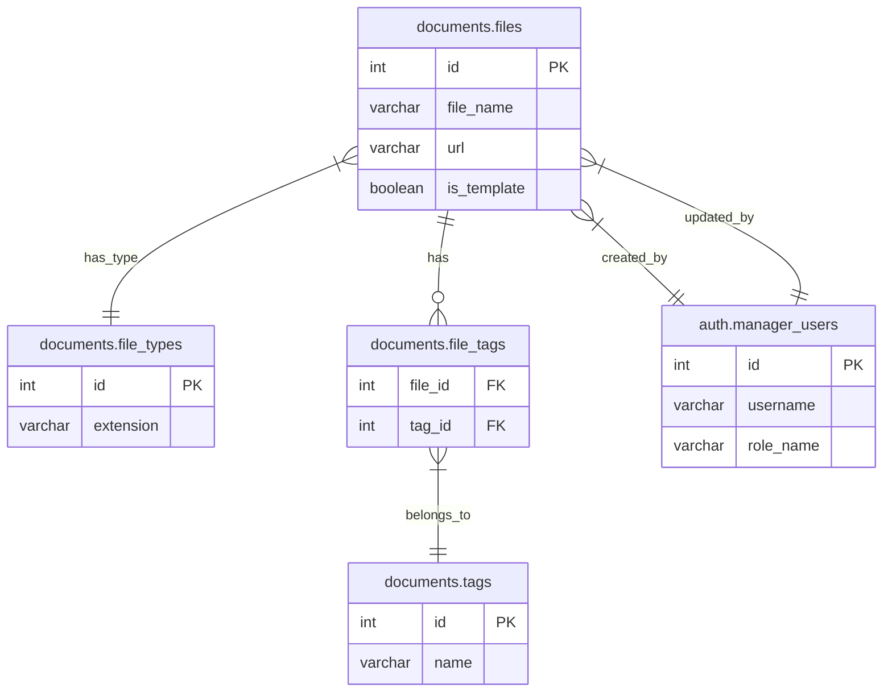

# han-saku-zephyr
阪神さくら地区加盟員向けシステム

## 要件

- Python 3.8.20
- MySQL 8.0
- Docker と Docker Compose
- Poetry (パッケージ管理)

## ER図



## セットアップ方法

### 開発環境の起動

```bash
# Docker Composeでアプリとデータベースを起動
docker-compose up -d

# マイグレーションの実行
docker-compose run --rm migration
```

### テストの実行

```bash
docker-compose run --rm web poetry run pytest
```

## プロジェクト構成

- `app/`: アプリケーションのメインコード
  - `models/`: データモデル
  - `templates/`: HTMLテンプレート
  - `views/`: ビューコントローラー
- `migrations/`: データベースマイグレーションファイル
- `tests/`: テストコード

## 本番環境

本番環境ではCGIを使用してアプリケーションを起動します。`index.cgi`が起動スクリプトとして機能します。

## ドキュメント

- [技術仕様書](docs/TECHNICAL_SPECIFICATION.md) - アプリケーションの詳細な技術仕様と設計
