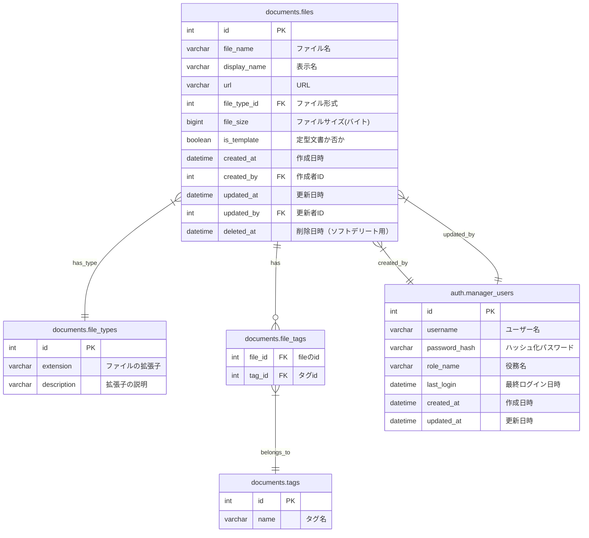

# han-saku-zephyr アプリケーション仕様書

## 1. 概要

このドキュメントでは、阪神さくら地区加盟員向けシステム「han-saku-zephyr」の仕様を定義します。本システムはFlaskフレームワークを使用したWebアプリケーションで、ファイル管理機能を提供します。

## 2. システム構成

### 2.1 技術スタック

- **バックエンド**: Python 3.8.20, Flask 3.0.3
- **データベース**: MySQL 8.0
- **ORM**: SQLAlchemy
- **マイグレーション**: Flask-Migrate
- **認証**: Flask-Login
- **クラウドストレージ**: Google Drive API

### 2.2 環境構成

- **開発環境**: Docker, Docker Compose
- **テスト環境**: pytest, pytest-flask
- **本番環境**: CGIスクリプト (index.cgi)

## 3. データモデル

### 3.1 スキーマ構成

- **auth**: 認証関連のスキーマ
- **documents**: ドキュメント管理関連のスキーマ

#### 3.1.1 ER図



### 3.2 テーブル定義

#### 3.2.1 auth.manager_users

管理者ユーザーの管理テーブル

| フィールド名 | データ型 | 説明 | 制約 |
|------------|---------|------|------|
| id | int | 主キー | PK, AUTO_INCREMENT |
| username | varchar(100) | ユーザー名 | UNIQUE, NOT NULL |
| password_hash | varchar(255) | ハッシュ化パスワード | NOT NULL |
| role_name | varchar(100) | 役務名 | NOT NULL |
| last_login | datetime | 最終ログイン日時 | NULL許容 |
| created_at | datetime | 作成日時 | NOT NULL, DEFAULT CURRENT_TIMESTAMP |
| updated_at | datetime | 更新日時 | NOT NULL, DEFAULT CURRENT_TIMESTAMP ON UPDATE |

#### 3.2.2 documents.file_types

ファイルの拡張子に関する情報

| フィールド名 | データ型 | 説明 | 制約 |
|------------|---------|------|------|
| id | int | 主キー | PK, AUTO_INCREMENT |
| extension | varchar(50) | ファイルの拡張子 | UNIQUE, NOT NULL |
| description | varchar(255) | 拡張子の説明 | NOT NULL |

#### 3.2.3 documents.tags

タグに関するマスター

| フィールド名 | データ型 | 説明 | 制約 |
|------------|---------|------|------|
| id | int | 主キー | PK, AUTO_INCREMENT |
| name | varchar(100) | タグ名 | UNIQUE, NOT NULL |

#### 3.2.4 documents.files

ファイルの情報を格納する

| フィールド名 | データ型 | 説明 | 制約 |
|------------|---------|------|------|
| id | int | 主キー | PK, AUTO_INCREMENT |
| file_name | varchar(255) | ファイル名 | NOT NULL |
| display_name | varchar(255) | 表示名 | NOT NULL |
| url | varchar(1000) | URL | NOT NULL |
| file_type_id | int | ファイル形式 | FK (file_types.id), NOT NULL |
| file_size | bigint | ファイルサイズ(バイト) | NOT NULL |
| is_template | tinyint(1) | 定型文書か否か | NOT NULL, DEFAULT 0 |
| created_at | datetime | 作成日時 | NOT NULL, DEFAULT CURRENT_TIMESTAMP |
| created_by | int | 作成者ID | FK (manager_users.id), NOT NULL |
| updated_at | datetime | 更新日時 | NOT NULL, DEFAULT CURRENT_TIMESTAMP ON UPDATE |
| updated_by | int | 更新者ID | FK (manager_users.id), NOT NULL |
| deleted_at | datetime | 削除日時（ソフトデリート用） | NULL許容 |

#### 3.2.5 documents.file_tags

ファイルについているタグの情報

| フィールド名 | データ型 | 説明 | 制約 |
|------------|---------|------|------|
| file_id | int | fileのid | PK, FK (files.id), CASCADE |
| tag_id | int | タグid | PK, FK (tags.id), CASCADE |

## 4. アプリケーション構造

### 4.1 ディレクトリ構造

```
han-saku-zephyr/
├── app/
│   ├── __init__.py          # アプリケーション初期化
│   ├── config.py            # 環境別設定
│   ├── commands/            # カスタムコマンド
│   ├── models/              # データモデル
│   │   ├── __init__.py
│   │   ├── base.py          # 基本モデル
│   │   ├── auth/            # 認証関連モデル
│   │   └── documents/       # ドキュメント関連モデル
│   ├── templates/           # HTMLテンプレート
│   └── views/               # ビューコントローラー
│       ├── __init__.py
│       └── main/            # メイン機能ビュー
├── migrations/              # マイグレーションファイル
│   └── sql/                 # SQLスクリプト
├── tests/                   # テストコード
│   ├── conftest.py          # テスト設定
│   └── test_app.py          # アプリケーションテスト
├── wsgi.py                  # WSGI起動ファイル
├── Dockerfile               # Dockerビルド設定
├── docker-compose.yml       # Dockerコンテナ構成
├── poetry.lock              # 依存関係ロックファイル
├── pyproject.toml           # プロジェクト設定
└── app/index.cgi            # 本番環境CGIスクリプト
```

### 4.2 Blueprints

- **main**: メインルート (`app/views/main/`)

## 5. エンドポイント仕様

### 5.1 Webページエンドポイント

#### 5.1.1 トップページ

- **URL**: `/`
- **メソッド**: GET
- **レスポンス**: `index.html` テンプレートをレンダリング
- **説明**: アプリケーションのトップページ
- **実装**: `app/views/main/routes.py` の `index()` 関数

#### 5.1.2 アバウトページ

- **URL**: `/about`
- **メソッド**: GET
- **レスポンス**: `index.html` テンプレート（content="About Page"パラメータ付き）
- **説明**: アプリケーションの説明ページ（サンプル）
- **実装**: `app/views/main/routes.py` の `about()` 関数

### 5.2 API エンドポイント

#### 5.2.1 ファイルタイプ一覧取得

- **URL**: `/api/file-types`
- **メソッド**: GET
- **レスポンスフォーマット**: JSON
- **レスポンス例**:
  ```json
  [
    {
      "id": 1,
      "extension": "pdf",
      "description": "PDF形式"
    },
    {
      "id": 2,
      "extension": "docx",
      "description": "Microsoft Word文書"
    }
  ]
  ```
- **説明**: 全てのファイルタイプを一覧で返す
- **実装**: `app/views/main/routes.py` の `file_types()` 関数

#### 5.2.2 タグ一覧取得

- **URL**: `/api/tags`
- **メソッド**: GET
- **レスポンスフォーマット**: JSON
- **レスポンス例**:
  ```json
  [
    {
      "id": 1,
      "name": "BVS"
    },
    {
      "id": 2,
      "name": "CS"
    }
  ]
  ```
- **説明**: 全てのタグを一覧で返す
- **実装**: `app/views/main/routes.py` の `tags()` 関数

## 6. フロントエンド仕様

### 6.1 テンプレート構成

システムで使用するテンプレートの構造と機能概要を以下に示します。

#### 6.1.1 ベーステンプレート (base.html)

- **役割**: 全ページの共通レイアウトを提供するベーステンプレート
- **主要機能**:
  - レスポンシブデザインのメタタグ
  - タイトルブロック
  - スタイルブロック（カスタムCSSの挿入用）
  - コンテンツブロック（各ページのメインコンテンツ用）
  - スクリプトブロック（JavaScript挿入用）
- **ファイル場所**: `app/templates/base.html`

#### 6.1.2 インデックスページ (index.html)

- **役割**: アプリケーションのトップページ
- **継承元**: base.html
- **主要機能**: ウェルカムメッセージの表示
- **ファイル場所**: `app/templates/index.html`

## 7. デプロイメント

### 7.1 開発環境

```bash
# Docker Composeでアプリとデータベースを起動
docker-compose up -d

# マイグレーションの実行
docker-compose run --rm migration
```

### 7.2 テスト実行

```bash
docker-compose run --rm web poetry run pytest
```

### 7.3 本番環境

本番環境ではCGIを使用してアプリケーションを起動します。

- **エントリーポイント**: `app/index.cgi`
- **設定ファイル**: `app/config.py` の `ProductionConfig` クラス

## 8. カスタムコマンド

### 8.1 データベース初期化

```bash
flask init-db [--force]
```

- **説明**: SQLファイルからデータベースを初期化する
- **オプション**: `--force` 既存のスキーマを強制的に上書きする
- **実装**: `app/commands/db_commands.py` の `init_db_command()` 関数

## 9. エラー処理

*（詳細は実装されていません - 必要に応じて定義）*

## 10. セキュリティ

### 10.1 認証

- **メカニズム**: Flask-Loginを使用
- **パスワード保存**: ハッシュ化（具体的なハッシュ方式は明示されていません）

### 10.2 CSRF保護

*（詳細は実装されていません - 必要に応じて定義）*

## 11. 将来の拡張計画

*（詳細は定義されていません - 必要に応じて追加）*

---

## 変更履歴

| バージョン | 日付 | 変更内容 | 担当者 |
|-----------|------|---------|--------|
| 0.1.0 | 2025-03-15 | 初版作成 | - |